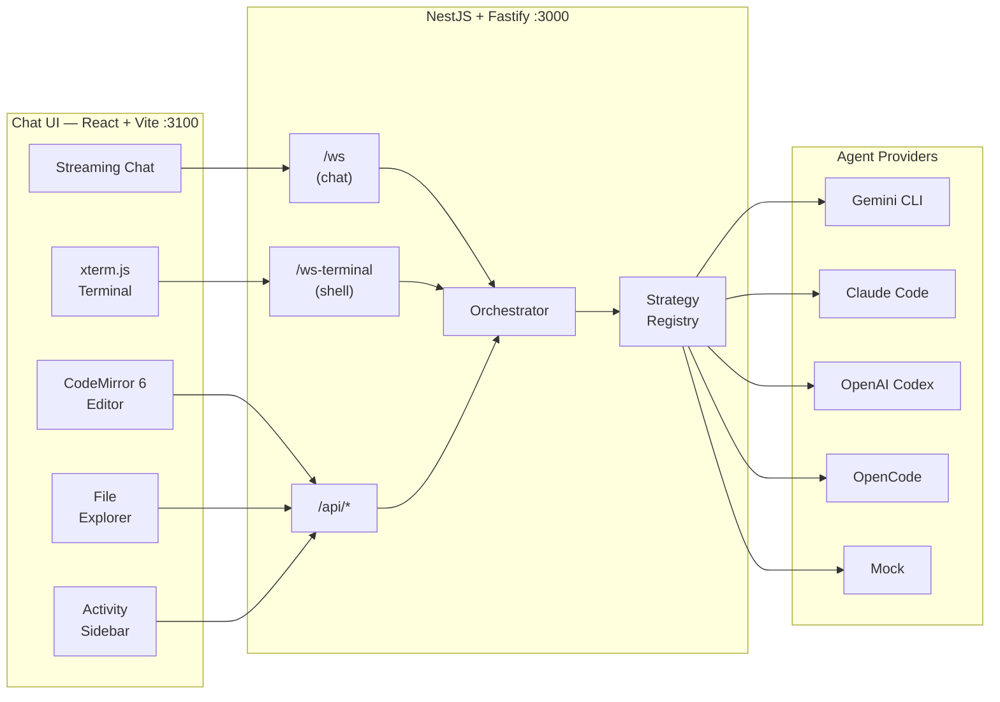

# Agents

This document is the single reference for everything agent-related in this repository: supported providers, configuration, authentication modes, conversation scoping, the WebSocket protocol, REST API surface, Docker images, and local development.

For full REST and WebSocket specs see [`docs/API.md`](docs/API.md).

---

## Table of contents

- [Overview](#overview)
- [Providers](#providers)
- [Environment variables](#environment-variables)
- [Authentication modes](#authentication-modes)
- [Conversation context & persistence](#conversation-context--persistence)
- [Steering](#steering)
- [WebSocket protocol (`/ws`)](#websocket-protocol-ws)
- [WebSocket terminal (`/ws-terminal`)](#websocket-terminal-ws-terminal)
- [REST API](#rest-api)
- [Docker images](#docker-images)
- [Local development](#local-development)
- [Architecture](#architecture)
- [Adding a new provider](#adding-a-new-provider)

---

## Overview

The API (`apps/api`) acts as a thin orchestration layer between the chat frontend and an agent provider CLI. Each incoming WebSocket message is dispatched through the **OrchestratorService** → **StrategyRegistryService** → the active **AgentStrategy**, which spawns or communicates with a provider process and streams chunks back over the same WebSocket.

```
Chat UI  ──ws──▶  OrchestratorService  ──▶  StrategyRegistryService
                                                     │
                        ┌────────────────────────────┤
                        ▼            ▼               ▼
                   GeminiStrategy  ClaudeStrategy  OpenCodeStrategy  …
```

Two WebSocket servers share a single HTTP upgrade dispatcher — `/ws` for chat and `/ws-terminal` for PTY shell sessions — avoiding competing upgrade listeners.

---

## Providers

| `AGENT_PROVIDER` value | Aliases | CLI tool installed | Docker tag |
|------------------------|---------|-------------------|------------|
| `gemini`               | — | `@google/gemini-cli` | `gemini` |
| `claude-code` (code default) | — | `@anthropic-ai/claude-code` | `claude-code` |
| `openai-codex`         | `openai` | `@openai/codex` | `openai-codex` |
| `opencode`             | `opencodex` | `opencode-ai` | `opencode` |
| `mock`                 | — | _(built-in, no CLI)_ | — |

> **Note:** When `AGENT_PROVIDER` is not set, the code falls back to `claude-code`. The `.env.example` file sets it to `gemini` for convenience — always set it explicitly in production.

`mock` is useful for local UI development without any API key. It echoes configurable fake responses.

### Strategy files

All strategies live under `apps/api/src/app/strategies/`:

| File | Strategy |
|------|----------|
| `gemini.strategy.ts` | Gemini CLI — OAuth device flow or `GEMINI_API_KEY` |
| `claude-code.strategy.ts` | Claude Code — OAuth or `ANTHROPIC_API_KEY` |
| `openai-codex.strategy.ts` | OpenAI Codex — OAuth or `OPENAI_API_KEY` |
| `opencode.strategy.ts` | OpenCode — auto-detects key from env |
| `mock.strategy.ts` | No-op mock for local development |
| `abstract-cli.strategy.ts` | Shared base for all CLI strategies |
| `strategy-registry.service.ts` | Resolves the active strategy from `AGENT_PROVIDER` |
| `strategy.types.ts` | Shared TypeScript interfaces (`AgentStrategy`, `AuthConnection`, `StreamingCallbacks`, `TokenUsage`, etc.) |

### `AgentStrategy` interface

Every provider implements `AgentStrategy` from `strategy.types.ts`:

| Method | Required | Description |
|--------|----------|-------------|
| `executeAuth(connection)` | ✓ | Start the auth flow (OAuth / device code / paste) |
| `submitAuthCode(code)` | ✓ | Submit an OAuth code |
| `cancelAuth()` | ✓ | Abort an in-progress auth flow |
| `clearCredentials()` | ✓ | Delete cached tokens / session files |
| `executeLogout(connection)` | ✓ | Run provider logout command |
| `checkAuthStatus()` | ✓ | Async — return `true` if authenticated |
| `executePromptStreaming(prompt, model, onChunk, callbacks?, systemPrompt?)` | ✓ | Stream a response; call `onChunk` per text chunk |
| `ensureSettings?()` | optional | Write provider config files before first run |
| `getWorkingDir?()` | optional | Working directory override for the CLI process |
| `getModelArgs?(model)` | optional | Translate a model name to CLI args |
| `listModels?()` | optional | Return available model names |
| `interruptAgent?()` | optional | Kill the running CLI process |

---

## Environment variables

Copy `.env.example` to `.env` before starting.

### API (`apps/api`)

| Variable | Default | Description |
|----------|---------|-------------|
| `PORT` | `3000` | API listen port |
| `AGENT_PROVIDER` | `gemini` | Active provider: `gemini` \| `claude-code` \| `openai-codex` \| `opencode` \| `mock` |
| `AGENT_AUTH_MODE` | `oauth` | `oauth` — interactive browser/device flow; `api-token` — env-var key only |
| `AGENT_PASSWORD` | — | When set, all `/api` and `/ws` endpoints require `Authorization: Bearer <password>` or `?token=<password>` |
| `MODEL_OPTIONS` | — | Comma-separated model names shown in the selector (e.g. `flash-lite,flash,pro`) |
| `DEFAULT_MODEL` | first in `MODEL_OPTIONS` | Pre-selected model on startup |
| `DATA_DIR` | `./data` | Base data directory for persistence |
| `FIBE_AGENT_ID` | — | Conversation id set by Fibe; data stored at `DATA_DIR/<id>/` |
| `CONVERSATION_ID` | — | Fallback conversation id for non-Fibe multi-conversation use |
| `SYSTEM_PROMPT` | — | Inline system prompt (overrides file) |
| `SYSTEM_PROMPT_PATH` | `dist/assets/SYSTEM_PROMPT.md` | Path to a custom system prompt file |
| `PLAYGROUNDS_DIR` | `./playground` | Root for the file explorer and shell sessions |
| `PLAYROOMS_ROOT` | `/opt/fibe` | Root directory for the playground selector (browse & link playrooms) |
| `POST_INIT_SCRIPT` | — | Shell script run once on first boot; state at `GET /api/init-status` |
| `SESSION_DIR` | — | Provider config/session dir (e.g. `~/.gemini`, `~/.codex`) |
| `AGENT_CREDENTIALS_JSON` | — | JSON map of credential file names to content, injected at startup |
| `ENCRYPTION_KEY` | — | Optional 32-char key for AES-256-GCM data-at-rest encryption |
| `FIBE_API_KEY` | — | Fibe platform API key for sync |
| `FIBE_API_URL` | — | Fibe platform API URL |
| `FIBE_SYNC_ENABLED` | — | Set to `true` to enable Fibe platform sync |
| `CORS_ORIGINS` | `localhost:3100,localhost:4300` | Comma-separated allowed CORS origins (use `*` for open/iframe use) |
| `FRAME_ANCESTORS` | `*` | CSP `frame-ancestors` — restrict in production |
| `LOG_LEVEL` | `info` | `error` \| `warn` \| `info` \| `debug` \| `verbose` |
| `MCP_CONFIG_JSON` | — | JSON object `{ mcpServers: { "<name>": { serverUrl?, authHeader?, command?, args?, env? } } }` — HTTP or stdio MCP servers injected into provider config at startup |
| `DOCKER_MCP_CONFIG_JSON` | — | Same format as `MCP_CONFIG_JSON`; merged with it. Typically carries Docker-specific MCP servers (e.g. docker MCP toolkit) |

### Provider API keys (`AGENT_AUTH_MODE=api-token`)

| Provider | Environment variable(s) |
|----------|------------------------|
| Gemini | `GEMINI_API_KEY` |
| Claude Code | `ANTHROPIC_API_KEY`, `CLAUDE_API_KEY`, or `CLAUDE_CODE_OAUTH_TOKEN` |
| OpenAI Codex | `OPENAI_API_KEY` |
| OpenCode (auto-detect) | `ANTHROPIC_API_KEY`, `OPENAI_API_KEY`, `GEMINI_API_KEY`, or `OPENROUTER_API_KEY` |

### Chat app (`apps/chat`, served via `GET /api/runtime-config`)

These variables are consumed at **runtime** (not build time) — the frontend fetches them from `GET /api/runtime-config` on load.

| Variable | Description |
|----------|-------------|
| `API_URL` | API base URL when running on a different host (default: same origin) |
| `LOCK_CHAT_MODEL` | Set to `true` to disable the model selector in the UI |
| `ASSISTANT_AVATAR_URL` | URL for the AI avatar image |
| `ASSISTANT_AVATAR_BASE64` | Base64-encoded SVG/PNG for the AI avatar (takes precedence over URL) |
| `USER_AVATAR_URL` | URL for the user avatar image |
| `USER_AVATAR_BASE64` | Base64-encoded SVG/PNG for the user avatar (takes precedence over URL) |
| `VITE_THEME_SOURCE` | `localStorage` (default) or `frame` — drive theme from parent via `postMessage` |
| `VITE_HIDE_THEME_SWITCH` | `1` / `true` — hide the in-app theme toggle |

---

## Authentication modes

### `oauth` (default)

The strategy opens a browser URL or device-code flow. Steps:

1. Client sends `initiate_auth` over WebSocket.
2. Server emits `auth_url_generated` (OAuth) or `auth_device_code` (device flow) or `auth_manual_token` (Claude paste flow).
3. User completes auth in browser / pastes token.
4. Server emits `auth_success`.

### `api-token`

When `AGENT_AUTH_MODE=api-token`:
- `check_auth_status` uses the presence of the relevant env var as source of truth.
- `initiate_auth` immediately succeeds if the env var is present; otherwise reports `unauthenticated` without opening a browser.
- No interactive flow is needed — ideal for Docker / CI / API-key-only environments.

### Credential injection (Docker / Fibe)

`AGENT_CREDENTIALS_JSON` contains a JSON map of file names to their content. `credential-injector.ts` writes those files into `SESSION_DIR` before the strategy starts (files written with mode `0o600`), enabling passwordless startup:

```json
// Gemini
{ "agent_token.txt": "ya29.xxx" }

// Claude Code
{ "auth.json": "{\"api_key\":\"sk-ant-...\"}" }

// OpenAI Codex (OAuth token only)
{ "auth.json": "{\"access_token\":\"...\"}" }

// OpenCode
{ "auth.json": "{\"api_key\":\"sk-...\"}" }
```

`SESSION_DIR` must be set alongside `AGENT_CREDENTIALS_JSON`. The injector skips filenames with path separators (traversal protection).

---

## Conversation context & persistence

All agent state (messages, activities, model choice, uploads, steering, init-status, and provider session dirs) is scoped by a **conversation id**:

| Env var | Description |
|---------|-------------|
| `FIBE_AGENT_ID` | Primary: set by Fibe when attaching a stored agent |
| `CONVERSATION_ID` | Fallback for non-Fibe multi-conversation setups |

When neither is set the conversation id is `default` and data lands directly in `DATA_DIR/`.

When set, each conversation gets its own subdirectory:

```
DATA_DIR/
└── <conversation-id>/
    ├── messages.json
    ├── activity.json
    ├── model.json
    ├── uploads/
    ├── steering/
    └── init-status/
```

Provider sessions (e.g. `--continue` for Claude, `--resume` for Gemini, Codex/OpenCode session dirs) are also scoped so the same agent id always resumes the same conversation after restarts.

---

## Steering

The **SteeringService** exposes a `STEERING.md` file in `DATA_DIR` that the agent CLI reads during a run. This enables real-time mid-run guidance without interrupting the agent.

- **Enqueue:** queued messages (from `queue_message` WS action) are written as dated list entries into `STEERING.md`.
- **Reset:** the file is cleared at the start of every new agent run.
- **File watching:** `SteeringService` watches the file (with a 100ms debounce) and emits `queue_updated` over WebSocket whenever the entry count changes.
- **Health check:** every 5 seconds, the service verifies the watcher is alive and the file exists (the agent may delete it). It recreates both if needed.
- **Lock:** writes use a directory-based lock (`STEERING.md.lock`) with a 30-second staleness timeout for crash recovery.

---

## WebSocket protocol (`/ws`)

**URL:** `ws://localhost:3000/ws` (or `wss://` in production)  
**Auth:** `?token=<password>` when `AGENT_PASSWORD` is set  
**Session:** single-active-session — a new connection displaces the existing one with close code `4002`

**Close codes:**

| Code | Meaning |
|------|---------|
| `4001` | Unauthorized (wrong or missing token) |
| `4002` | Session taken over by another client |

### Client → Server

All messages are JSON objects with an `action` field.

| `action` | Payload | Description |
|----------|---------|-------------|
| `check_auth_status` | — | Request current auth status |
| `initiate_auth` | — | Start provider auth flow |
| `submit_auth_code` | `{ code }` | Submit OAuth code |
| `cancel_auth` | — | Cancel ongoing auth |
| `reauthenticate` | — | Clear credentials and re-authenticate |
| `logout` | — | Log out from provider |
| `send_chat_message` | `{ text, images?, audio?, audioFilename?, attachmentFilenames? }` | Send user message; `images` = base64 data URLs, `audio` = base64, `attachmentFilenames` from `POST /api/uploads`. Text may contain `@path` references to playground files. If agent is busy, message is queued automatically. |
| `queue_message` | `{ text }` | Explicitly queue a message while the agent is busy |
| `submit_story` | `{ story }` | Submit activity story array after stream ends |
| `get_model` | — | Request current model |
| `set_model` | `{ model }` | Set model name |
| `interrupt_agent` | — | Stop the current agent run |

### Server → Client

All messages are JSON objects with a `type` field.

| `type` | Extra fields | Description |
|--------|-------------|-------------|
| `auth_status` | `status`, `isProcessing` | `authenticated` \| `unauthenticated` |
| `auth_url_generated` | `url` | OAuth URL to open |
| `auth_device_code` | `code` | Device code to display to user |
| `auth_manual_token` | — | Prompt user to paste a token (Claude) |
| `auth_success` | — | Auth completed |
| `logout_output` | `text` | CLI logout output chunk |
| `logout_success` | — | Logout completed |
| `error` | `message` | Error description |
| `message` | `id`, `role`, `body`, `created_at`, `imageUrls?`, `story?`, `model?` | Persisted message |
| `stream_start` | `model?` | Beginning of assistant response stream |
| `stream_chunk` | `text` | One chunk of the streaming response |
| `stream_end` | `usage?`, `model?` | End of stream; `usage: { inputTokens, outputTokens }` |
| `reasoning_start` | — | Start of reasoning/thinking stream |
| `reasoning_chunk` | `text` | Chunk of reasoning text |
| `reasoning_end` | — | End of reasoning stream |
| `thinking_step` | `id`, `title`, `status`, `details?`, `timestamp` | Discrete thinking step (`pending` \| `processing` \| `complete`) |
| `tool_call` | `name`, `path?`, `summary?`, `command?` | Tool invocation; `command` for terminal-style display |
| `file_created` | `name`, `path?`, `summary?` | File created by agent |
| `activity_snapshot` | `activity` | Full activity list sent on connect |
| `activity_appended` | `entry` | New activity added |
| `activity_updated` | `entry` | Existing activity updated |
| `playground_changed` | — | Playground directory changed |
| `queue_updated` | `count` | Number of queued messages |
| `model_updated` | `model` | Current model name changed |

**Story / activity timeline:** the client assembles a chronological story from `stream_start`, `reasoning_*`, `thinking_step`, `tool_call`, and `file_created` events (in order) and submits it back with `submit_story` after `stream_end`.

---

## WebSocket terminal (`/ws-terminal`)

**URL:** `ws://localhost:3000/ws-terminal`  
**Auth:** same `?token=<password>` as `/ws`

Each connection spawns a dedicated `node-pty` shell session in `PLAYGROUNDS_DIR`. Supports multiple simultaneous sessions (each gets a UUID).

**Client → Server messages:**

| Message | Description |
|---------|-------------|
| Raw string | Written directly to the PTY stdin |
| `{ type: "resize", cols: N, rows: N }` | Resize the PTY window |

**Server → Client:** raw terminal output (not JSON), batched in 16ms frames for efficiency.

The session is destroyed when the WebSocket closes or the PTY process exits.

---

## REST API

**Base URL:** `http://localhost:3000/api`  
**Auth:** `Authorization: Bearer <password>` or `?token=<password>` when `AGENT_PASSWORD` is set.  
**Rate limit:** 100 requests per minute per client.

| Method | Path | Auth | Description |
|--------|------|------|-------------|
| `GET` | `/api` | No | `{ message: 'Hello API' }` |
| `GET` | `/api/health` | No | `{ status: 'ok' }` — readiness / liveness probe |
| `POST` | `/api/auth/login` | No | `{ password? }` → `{ success, token? }` |
| `GET` | `/api/messages` | Bearer | Full message history |
| `GET` | `/api/activities` | Bearer | Activity timeline list |
| `GET` | `/api/activities/:activityId` | Bearer | Single activity |
| `GET` | `/api/activities/:activityId/:storyId` | Bearer | Deep link to a story entry |
| `GET` | `/api/activities/by-entry/:entryId` | Bearer | Activity containing a story entry |
| `GET` | `/api/model-options` | Bearer | Available model names array |
| `GET` | `/api/playgrounds` | Bearer | Playground file tree |
| `GET` | `/api/playgrounds/file?path=…` | Bearer | Read a playground file → `{ content }` |
| `PUT` | `/api/playgrounds/file` | Bearer | `{ path, content }` — save a playground file → `{ ok }` |
| `GET` | `/api/playgrounds/stats` | Bearer | Playground directory stats |
| `GET` | `/api/playrooms/browse?path=…` | Bearer | Browse `PLAYROOMS_ROOT` directory |
| `POST` | `/api/playrooms/link` | Bearer | `{ path }` — symlink a playroom as `./playground` → `{ ok, linkedPath }` |
| `GET` | `/api/playrooms/current` | Bearer | Current linked playroom path → `{ current }` |
| `GET` | `/api/agent-files` | Bearer | Agent-generated file tree |
| `GET` | `/api/agent-files/file?path=…` | Bearer | Read an agent-generated file |
| `POST` | `/api/uploads` | Bearer | Upload file (multipart, ≤ 20 MB) → `{ filename }` |
| `GET` | `/api/uploads/:filename` | Bearer | Serve an uploaded file |
| `POST` | `/api/agent/send-message` | Bearer | `{ text, images?, attachmentFilenames? }` → `202 { accepted, messageId }` |
| `GET` | `/api/init-status` | Bearer | Post-init script state |
| `GET` | `/api/data-privacy/export` | Bearer | Export conversation data as JSON |
| `DELETE` | `/api/data-privacy` | Bearer | Permanently delete conversation data |
| `GET` | `/api/runtime-config` | No | Runtime env vars exposed to the chat frontend (avatars, etc.) |

**`POST /api/agent/send-message`** is designed for webhooks and integrations (e.g. Sentry). It returns `400` (empty text), `403` (need auth), or `409` (agent busy).

**`PUT /api/playgrounds/file`** is used by the CodeMirror editor to persist file edits without leaving the chat UI.

---

## Docker images

CI publishes multi-arch (`linux/amd64`, `linux/arm64`) images to GHCR on every push to `main` or `dev`:

```
ghcr.io/<owner>/fibe-agent:gemini-latest
ghcr.io/<owner>/fibe-agent:claude-code-latest
ghcr.io/<owner>/fibe-agent:openai-codex-latest
ghcr.io/<owner>/fibe-agent:opencode-latest

# Dev branch:
ghcr.io/<owner>/fibe-agent:<provider>-latest-dev

# Immutable SHA pin:
ghcr.io/<owner>/fibe-agent:<provider>-<git-sha>
```

The provider is baked in at build time via `--build-arg AGENT_PROVIDER=<value>`. The image installs the corresponding CLI tool plus system dependencies: git, docker, ripgrep, fd, Python, Deno, uv, ffmpeg, ImageMagick, Playwright/Chromium (for MCP), sqlite3, pandoc, and more. The built `dist/` (API) and `chat/` (frontend) bundles are copied in last to maximise layer cache reuse.

### Run with Docker

```sh
docker run -p 3000:3000 \
  -e AGENT_PROVIDER=gemini \
  -e GEMINI_API_KEY=AIza... \
  -e AGENT_AUTH_MODE=api-token \
  ghcr.io/<owner>/fibe-agent:gemini-latest
```

### Session directories per provider

| Provider | `SESSION_DIR` |
|----------|--------------|
| `gemini` | `/home/node/.gemini` |
| `claude-code` | `/home/node/.claude` |
| `openai-codex` | `/home/node/.codex` |
| `opencode` | `/home/node/.local/share/opencode` |

---

## Local development

### Prerequisites

- [Bun](https://bun.sh) — version pinned in `packageManager` in `package.json` (`bun@1.3.11`)
- Node 24 (see `.nvmrc`) for native addon compatibility (`node-pty`)

### Setup

```sh
bun install
cp .env.example .env  # fill in AGENT_PROVIDER and relevant keys
bun run dev           # starts API :3000 + Chat :3100 in parallel
```

### Run services individually

```sh
bunx nx serve api     # API only  → http://localhost:3000
bunx nx serve chat    # Chat only → http://localhost:3100
```

### Without an API key (mock provider)

```sh
AGENT_PROVIDER=mock bunx nx serve api
```

### Scripts

| Script | Command | Description |
|--------|---------|-------------|
| `dev` | `bun run dev` | API + Chat in parallel |
| `build` | `bun run build` | Build all apps |
| `lint` | `bun run lint` | Lint all projects |
| `test` | `bun run test` | Run unit test suite |
| `typecheck` | `bun run typecheck` | TypeScript type-check |
| `e2e` | `bun run e2e` | Playwright e2e suites |
| `ci` | `bun run ci` | lint + build + typecheck + test |
| `ci:notest` | `bun run ci:notest` | lint + build + typecheck only |

### Testing

Unit tests are co-located with source files (`*.spec.ts` / `*.test.ts`). Coverage is enforced at 100%.

```sh
bun run test                    # all projects
bunx nx test api                # API only
bunx nx test chat               # Chat only
```

Playwright e2e:

```sh
bun run e2e                     # all e2e suites
bunx nx e2e e2e-api             # API e2e only
bunx nx e2e e2e-chat            # Chat e2e only
```

---

## Architecture



### API module map

| Module | Location | Responsibility |
|--------|----------|----------------|
| `orchestrator` | `app/orchestrator/` | Drives agent runs, streams chunks, manages session state |
| `strategies` | `app/strategies/` | Provider adapters + strategy registry |
| `agent` | `app/agent/` | `POST /api/agent/send-message` — async webhook endpoint |
| `agent-files` | `app/agent-files/` | File watcher + REST for agent-generated files |
| `auth` | `app/auth/` | Bearer token guard and login endpoint |
| `messages` / `message-store` | `app/messages/`, `app/message-store/` | Message history REST + in-memory store |
| `activity` / `activity-store` | `app/activity/`, `app/activity-store/` | Activity timeline REST + in-memory store |
| `model-options` / `model-store` | `app/model-options/`, `app/model-store/` | Model list + selection state |
| `playgrounds` | `app/playgrounds/` | File tree watcher, REST, playroom browser + linker |
| `uploads` | `app/uploads/` | Multipart upload validation + file serving |
| `terminal` | `app/terminal/` | `node-pty` shell sessions over `/ws-terminal` |
| `steering` | `app/steering/` | `STEERING.md` queue, file watcher, lock management |
| `fibe-sync` | `app/fibe-sync/` | Syncs conversation state to the Fibe platform |
| `github-token-refresh` | `app/github-token-refresh/` | Refreshes GitHub OAuth tokens for Codex |
| `init-status` | `app/init-status/` | Tracks `POST_INIT_SCRIPT` execution state |
| `persistence` | `app/persistence/` | Base filesystem persistence helpers |
| `config` | `app/config/` | Central env-config service |
| `audit` | `app/audit/` | Request audit logging interceptor |
| `crypto` | `app/crypto/` | AES-256-GCM data-at-rest encryption |
| `data-privacy` | `app/data-privacy/` | GDPR export and delete endpoints |
| `runtime-config` | `app/runtime-config/` | Exposes runtime env vars (avatars, etc.) to the frontend |

---

## Adding a new provider

1. **Create a strategy** in `apps/api/src/app/strategies/<name>.strategy.ts` implementing the `AgentStrategy` interface from `strategy.types.ts`. Extend `AbstractCliStrategy` if it wraps a CLI binary.
2. **Register it** in `strategy-registry.service.ts` — add a new `case` for your `AGENT_PROVIDER` value.
3. **Update the Dockerfile** — add an `elif` branch to install your CLI in the `cli` and final stages; add a session directory `mkdir` in the final stage.
4. **Document provider keys** in `.env.example` and add them to the table in this file.
5. **Write tests** — add `<name>.strategy.test.ts` with the same coverage pattern as the existing strategies.
6. **Add a CI matrix entry** in `.github/workflows/ci.yml` under `strategy.matrix.provider`.
