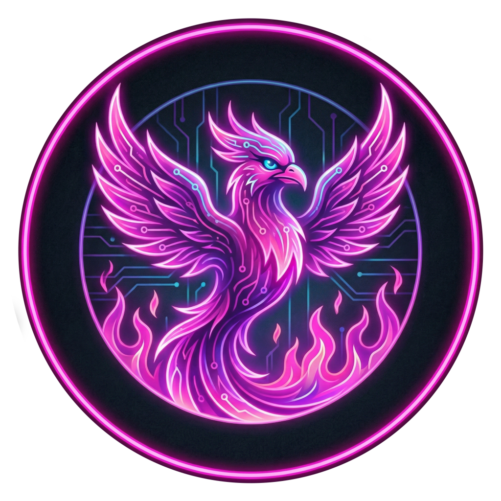
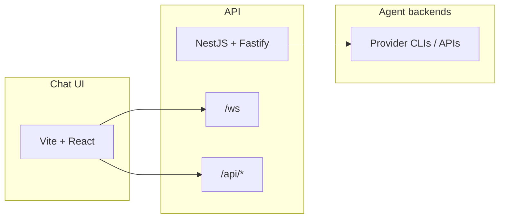

<p align="center">
  
</p>

<h1 align="center">Phoenix Agent</h1>

<p align="center">
  <strong>Agent orchestration, chat UI, and OAuth-ready APIs—built as a production-grade Nx monorepo.</strong>
</p>

<p align="center">
  <a href="https://github.com/phoenix-playgrounds/phoenix-agent-oauth/actions/workflows/ci.yml"></a>
  <a href="https://bun.sh"></a>
  <a href="https://nx.dev"></a>
  
</p>

---

**Phoenix Agent** pairs a **NestJS + Fastify** API with a **React + Vite** chat client. The API drives coding agents (Gemini, Claude Code, OpenAI Codex, OpenCode, or a mock provider); the UI handles login, streaming replies, model selection, markdown rendering, and provider OAuth when you need it.

## Highlights

| | |
| --- | --- |
| **Multi-provider** | Switch agents via `AGENT_PROVIDER`; optional stored credentials and session dirs for containerized deploys. |
| **Real-time chat** | WebSocket at `/ws` with structured client/server actions, single active session semantics, and [documented close codes](docs/API.md#websocket). |
| **REST + integrations** | Messages, activities, uploads, playgrounds, init scripts, and `POST /api/agent/send-message` for async hooks—see [docs/API.md](docs/API.md). |
| **Structured logs** | JSON-per-line logging for containers and aggregators (`LOG_LEVEL`, request IDs, HTTP and WS context)—[details](docs/API.md#container-logging). |
| **E2E & CI** | Playwright suites under `apps/e2e-api` and `apps/e2e-chat`; GitHub Actions runs lint, build, and typecheck on every push/PR. |
| **Docker** | Multi-arch images published to **GHCR** per provider (`gemini`, `claude-code`, `openai-codex`, `opencode`)—see [CI workflow](.github/workflows/ci.yml). |

## Architecture



## Quick start

**Prerequisites:** [Bun](https://bun.sh) (version pinned in `package.json` as `packageManager`).

```sh
bun install
bun run dev
```

- **API:** [http://localhost:3000](http://localhost:3000) — health at `/api/health`
- **Chat:** [http://localhost:3100](http://localhost:3100) — Vite proxies `/api` and `/ws` to the API by default

No provider CLI yet? Use the mock agent:

```sh
AGENT_PROVIDER=mock bunx nx serve api
```

If the API runs on another host or port:

```sh
API_URL=http://localhost:3000 bunx nx serve chat
```

When `AGENT_PASSWORD` is set, open the chat and sign in with that password before sending messages.

### Run services separately

| App | Command | Default port |
| --- | --- | ---: |
| API | `bunx nx serve api` | 3000 |
| Chat | `bunx nx serve chat` | 3100 |

## Lockfiles and installs

This repo keeps **`bun.lock`** for Bun, CI, and Docker, and **`package-lock.json`** for npm compatibility.

Bun prefers `bun.lock` when it exists. **Do not delete `bun.lock` and then run `bun install` without restoring it**—workspace installs can fail with cache/`FileNotFound`-style errors. For reproducible CI, commit `bun.lock` and use `bun install --frozen-lockfile` in automation (as in CI).

## Environment

Copy `.env.example` to `.env` and adjust.

**API (summary):** `PORT`, `CORS_ORIGINS`, `FRAME_ANCESTORS`, `AGENT_PASSWORD`, `AGENT_PROVIDER`, `MODEL_OPTIONS`, `DATA_DIR`, `SYSTEM_PROMPT_PATH`, `PHOENIX_AGENT_ID` / `CONVERSATION_ID`, provider keys (`GEMINI_API_KEY`, `ANTHROPIC_API_KEY`, `OPENAI_API_KEY`, `OPENROUTER_API_KEY`, …), `SESSION_DIR`, `AGENT_CREDENTIALS_JSON`, `POST_INIT_SCRIPT`, `LOG_LEVEL`.

**Chat (optional):** `API_URL`, `LOCK_CHAT_MODEL`, `ASSISTANT_AVATAR_URL`, `USER_AVATAR_URL`.

OpenCode and multi-key setups are documented inline in [`.env.example`](.env.example).

## Project layout

| Path | Role |
| --- | --- |
| `apps/api` | NestJS API, WebSocket `/ws`, REST under `/api` |
| `apps/chat` | React chat UI (login, OAuth modal, model selector, GFM markdown, copy raw message, TS one-line reflow in UI only) |
| `apps/e2e-api`, `apps/e2e-chat` | Playwright e2e (named so `bun test apps/api` does not pick up e2e by path prefix) |
| `docs/API.md` | REST, WebSocket, and container logging contract |

## Scripts

| Script | Command | Description |
| --- | --- | --- |
| **dev** | `bun run dev` | API + chat in parallel |
| **build** | `bun run build` | Build all apps |
| **lint** | `bun run lint` | Lint all projects |
| **test** | `bun run test` | Unit tests |
| **typecheck** | `bun run typecheck` | Type-check all projects |
| **e2e** | `bun run e2e` | Playwright e2e targets |
| **ci** | `bun run ci` | Lint, build, and typecheck (matches the main CI job) |
| **ci:test** | `bun run ci:test` | Same as **ci** plus unit tests |

## Container images

On push to `main` or `dev`, CI builds and pushes provider-specific images to GitHub Container Registry:

`ghcr.io/phoenix-playgrounds/phoenix-agent-oauth:<provider>-<tag>`

Providers align with `AGENT_PROVIDER` build args: `gemini`, `claude-code`, `openai-codex`, `opencode`. See the [Dockerfile](Dockerfile) and [CI workflow](.github/workflows/ci.yml) for build arguments and tags.

## License

MIT (see `package.json`).
